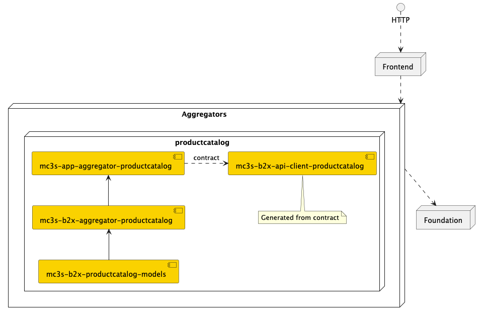
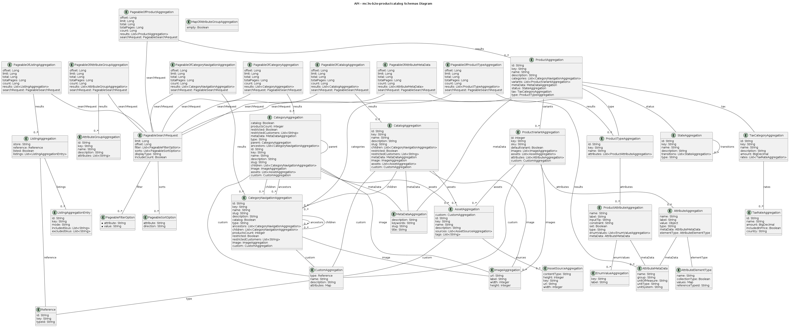

# mc3s-b2x-productcatalog

This module provides productcatalog related functionality.

## Modules

| Module                                                                    | Description                                      |
|---------------------------------------------------------------------------|--------------------------------------------------|
| [mc3s-app-aggregator-productcatalog](mc3s-app-aggregator-productcatalog/) | Contains the aggregator application.             |
| [mc3s-b2x-aggregator-productcatalog](mc3s-b2x-aggregator-productcatalog/) | Contains the business logic and API controllers. |
| [mc3s-b2x-productcatalog-models](mc3s-b2x-productcatalog-models/)         | Contains the data model, interfaces.             |
| [mc3s-b2x-aggregator-productreview](mc3s-b2x-aggregator-productreview/)   | Contains the business logic and API controllers. |
| [mc3s-b2x-productreview-models](mc3s-b2x-productreview-models/)           | Contains the data model, interfaces.             |
| [mc3s-b2x-api-client-productcatalog](mc3s-b2x-api-client-productcatalog)  | API Client                                       |

## Data model

[More details](docs/README.md)

## Useful additional information

- [Getting Started](docs/guidelines/GettingStarted.md)
- [Used 3rd party libraries and licenses](docs/reports)
- [Guidelines](docs/guidelines)
